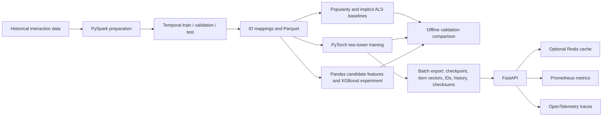

# Interview story: product recommender and serving demo

Use this page to explain the project without presenting it as a production
system. It is a learning-sized end-to-end recommender with measured offline
experiments and a local Docker serving demo.

## The problem and why it matters

An online shop has many products and interactions. Showing every product is
not useful, and showing only the globally most popular products can miss what
an individual shopper may want. A recommender uses past interaction patterns
to rank a manageable list of items for discovery. In a real business, better
product discovery could contribute to conversion, repeat visits, or retention;
this project has not measured those business outcomes.

The project models Amazon product-review interactions as **implicit feedback**:
an interaction is evidence that a user engaged with an item, not proof of a
positive rating or purchase. It builds a reproducible batch training path,
compares several ranking approaches offline, packages a model, and serves
recommendations through an API with basic observability.

## A concise version for an interview

> I built a learning-sized end-to-end product recommender to explore how an
> online store could help shoppers discover relevant items in a large catalog.
> I prepared temporally ordered interaction data with Spark, compared
> popularity, implicit ALS, a PyTorch two-tower model, and an offline XGBoost
> ranker, and tracked training and validation runs with MLflow. I packaged a
> bounded two-tower batch run and served its vectors through FastAPI with
> optional Redis caching, Prometheus metrics, and OpenTelemetry traces. On a
> matched 10,000-user validation cohort, the two-tower model averaged 2.21%
> Recall@10 versus 2.09% for popularity across three seeds, a small offline
> gain rather than a proven business improvement. I also ran one local Docker
> end-to-end demo. The project exposed real limitations: low absolute recall,
> poor rare-item coverage, slow Redis-outage fallback, and no AWS deployment
> or live user experiment yet.

This is intentionally candid: it describes what was built and measured, and
does not claim production impact.

## STAR version

### Situation

An online catalog can contain far more products than a shopper can browse.
Global popularity is a useful starting point, but it does not personalize the
list. I chose this as a practical recommender problem and used review
interactions as implicit feedback.

### Task

Build and explain a compact system that takes historical interactions through
data preparation, model comparison, batch artifact creation, and API serving.
The goal was to test the technical path and compare recommendation quality
with a simple baseline, not to claim a deployed business lift.

### Action

I used Spark for filtering, time-based splitting, integer ID mappings, and
implicit ALS so the data and collaborative-filtering steps could handle
distributed datasets. I kept popularity as a hard-to-misunderstand baseline.
I implemented an ID-only PyTorch two-tower model with pairwise negative
sampling and validation-based checkpoint selection. I also added a bounded
Pandas feature table and an XGBoost ranking experiment to learn where a
tree-based ranker fits. I matched users, training rows, and candidate items
for fair offline model comparisons, tracked runs in local MLflow, and exported
a serving bundle. FastAPI serves the two-tower model; Redis is an optional
cache; Prometheus and OpenTelemetry expose request behavior. I tested the
batch-to-API path locally in Docker Compose, including a Redis outage and
recovery.

### Result

Across three seeds on the same 10,000-user validation cohort and 50,507-item
candidate catalog, the two-tower model averaged 2.21% Recall@10 and 0.011180
NDCG@10; popularity reached 2.09% and 0.010294. That is a modest offline
ranking gain. Implicit ALS averaged below popularity. The sampled XGBoost
candidate experiment scored higher on its own sampled 100-item lists, but
those values are not comparable to full-catalog ranking and XGBoost is not
served by the API. The current Docker Compose demo passed health, known/unknown
user, metrics, trace, cache, and fallback checks. After a 200 ms connect/read
timeout fix, one rebuilt-container Redis outage request returned in 131 ms.
Five subsequent sequential requests with Redis healthy took 7.77–21.78 ms
(median 9.22 ms) with no concurrency. These are smoke measurements, not a
latency-at-load result. No
online conversion, retention, latency-at-load, AWS, or production-scale result
has been measured.

## Architecture and the reasons behind it

| Decision | Reason | Cost or limitation |
|---|---|---|
| Use chronological train/validation/test splits and train-only ID maps. | Better simulates recommending future interactions and reduces leakage from future IDs and activity. | New users/items are out of vocabulary; this ID-only model cannot personalize for them. |
| Keep popularity as the first baseline. | It is simple, cheap, and shows whether learned ranking adds value. | It is not personalized and favors popular items. |
| Include implicit ALS and two-tower retrieval. | ALS teaches matrix factorization; the tower gives a PyTorch embedding model that can score a user against a catalog. | The tested ALS setup lost to popularity. The tower is ID-only and has weak rare-item coverage. |
| Add XGBoost as a separate offline ranking experiment. | It demonstrates a common tabular ranking approach using item popularity and co-occurrence features, with Pandas for bounded feature construction. | Its 100-candidate sampled ranking metric is easier than full-catalog ranking. It is not in the serving API or a two-stage cascade. |
| Bound the batch run and export a portable serving bundle. | Makes the Spark-to-model-to-API path testable on a laptop and avoids retraining during requests. | The 500-user smoke model checks wiring only; it is not a large-scale training benchmark or strong model. |
| Separate batch training from API serving. | Training is offline and may use Spark/MLflow; serving only loads a checkpoint and item vectors. The API image therefore omits Spark/MLflow and uses CPU-only PyTorch. | The current API serves only two-tower checkpoints; training, ranking experiments, and MLflow tracking remain separate commands/services. |
| Precompute item vectors and use exact dot-product ranking. | Simple to understand and sufficient for this dataset-sized demo. | Scoring all 137,070 items for a request is not an efficient retrieval index for a much larger catalog. There is no ANN index. |
| Make Redis optional and retain local scoring fallback. | Cache can reduce repeated computation without making Redis the sole source of recommendations. | With 200 ms connect/read timeouts, one rebuilt-container outage request returned in 131 ms; five healthy-cache requests had a 9.22 ms median. These are smoke results, not an SLO. |
| Add Prometheus and OpenTelemetry locally. | Makes request count, latency, cache behavior, and HTTP spans visible during the demo. | These signals are not yet wired to a durable hosted observability service in AWS. |
| Keep AWS Terraform small and explicit. | ECS/Fargate, ECR, S3, IAM, CloudWatch, and an existing default VPC demonstrate a credible deployment path without extra DNS, load-balancer, certificate, or secret infrastructure. | AWS plan/apply has not been run. The demo uses public HTTP and is not hardened for sensitive traffic. |

## What this can be useful for in a real product

The core pattern—offline interaction processing, a candidate generator,
ranking evaluation, versioned artifacts, and an online recommendation API—is
useful for product discovery. A real team could use it to create personalized
home-page rows, related-item suggestions, or candidate lists for a later
ranker. The value would need to be established with business metrics such as
qualified clicks, add-to-cart rate, conversion, repeat usage, and retention,
measured in a controlled online experiment.

The most realistic production evolution is a **two-stage recommender**:

1. A fast retrieval stage uses two-tower embeddings plus an approximate
   nearest-neighbor index to reduce millions of products to hundreds.
2. A ranking stage uses XGBoost or another ranker on user, item, context, and
   retrieval features to order those candidates.
3. Business and policy rules remove unavailable, restricted, or already-seen
   products and apply diversity or sponsored-placement constraints.
4. A feedback loop logs impressions as well as clicks, carts, purchases, and
   dismissals, then refreshes features and models on a monitored schedule.

Other necessary production work includes content features for cold-start
users/items, online/offline feature consistency, access control and privacy
retention, load and failure testing, model and data drift monitoring, alerting,
automated rollback, reproducible CI/CD, durable remote experiment tracking,
and a costed AWS deployment. These are sensible next stages, not capabilities
this project already has.

## Where this project falls short

- **Absolute quality is low.** In the matched validation test, average
  Recall@10 was 2.21%; popularity was 2.09%. A small relative difference at
  low recall may have little product value.
- **The gain is offline, not causal.** There is no A/B test and no observed
  conversion, revenue, or retention lift. The current test checkpoint is
  limited because earlier experiments informed the cohort and model choices.
- **Rare products are poorly covered.** In the matched cohort, neither model
  retrieved targets with 0–2 training occurrences at Recall@10. Targets
  outside the sampled candidate catalog are counted as misses.
- **Cold start is unsolved.** A user or item absent from the training mapping
  has no learned ID vector. The API returns an error for unknown users; there
  is no content-based or popularity fallback for them.
- **Scale is unproven.** The real-data training/evaluation runs are bounded
  samples. The 17.4M-row production-scale job has not been benchmarked. Exact
  all-item scoring, in-memory histories, and local artifact collection need
  redesign or measurement for large traffic/catalogs.
- **Operations are a demo.** Compose was tested locally, but Kubernetes,
  Kafka's one-event producer/consumer check passed; Airflow's DAG loaded but
  its task could not run because Windows denied WSL access. AWS has not been
  deployed. The API image measured about 1.57 GB, and no load/SLO or
  security-hardening assessment has been completed.
- **Feedback and ranking are incomplete.** Streaming events are examples and
  do not update the live model. XGBoost is an offline experiment; the API does
  not use it after retrieval.

The detailed epoch, split, candidate-catalog, and model comparison evidence
is in the [test report](two_tower_test_report.md). The runbook and verified
runtime boundaries are in the [deployment walkthrough](deployment_walkthrough.md).

## Practical improvement plan

The next changes should close measured gaps and produce stronger evidence.
They should not add infrastructure just to make the project look larger.

### 1. Improve serving reliability

The earlier Redis outage took about **7.94 seconds**. Redis now has 200 ms
connect/read timeouts, and the API has a focused simulated-failure test. After
rebuilding the image, one uncached request with Redis stopped returned HTTP
200 and seven items in **131 ms**. This one-request smoke result does not
establish a latency SLO. The next check is a repeatable small latency sample
with Redis healthy, unavailable, and recovering, using the Prometheus
histogram and request outcomes to compare cached and uncached behavior.

### 2. Strengthen recommendation evaluation

Freeze one validation cohort, its complete training histories, and one
candidate catalog. Run popularity, ALS, and two-tower against the same rows
and candidates; repeat learned models across seeds. Report Recall@K and NDCG@K
overall and for user-history and target-popularity groups. This tests whether
the current small two-tower gain repeats and makes weak rare-item coverage
visible. Keep the existing test results out of tuning; they have already
informed this iteration, so a stronger final estimate requires a new
untouched holdout.

After the baseline rerun, make one model change at a time—for example, change
negative sampling or add item content features—and compare each change with
the same frozen validation inputs. Do not describe the current XGBoost result
as directly comparable to full-catalog retrieval: its sampled 100-item
candidate lists are easier. To make XGBoost a production-shaped stage, build
an explicit two-stage flow: retrieve a candidate set with the two-tower model,
rank those candidates with XGBoost features, and evaluate both stages on the
same users and held-out targets.

### 3. Demonstrate deployment or realistic scale

For AWS, first validate the Docker image and Terraform configuration locally.
Prepare a working AWS profile, region, client CIDR, and separate cost estimate.
Review the exact Terraform plan before applying it. Deploy the API to
ECS/Fargate, upload the model bundle to S3, send known-user and unknown-user
requests, then inspect readiness and CloudWatch logs. Record actual runtime,
artifact size, observed costs, and cleanup results. Destroy demo resources and
verify that billable resources and temporary artifacts are removed. Until
this run succeeds, describe AWS as configured code, not a deployed service.

For data scale, run the batch job at increasing row/user limits in a suitable
environment. Record input sizes, elapsed time, peak memory, output sizes, and
failures at each size. The target is the project's approximately 17.4M-row
dataset; claim support only after that workload completes successfully and
those measurements are saved. A successful 500-user smoke run only validates
workflow wiring.

These steps build on the current measured findings: small offline ranking
gains, weak rare-item coverage, slow cache-outage fallback, a 1.57 GB serving
image, and no AWS or 17.4M-row run yet. The order is **serving reliability,
repeatable model evaluation, then one measured deployment or scale run**.
